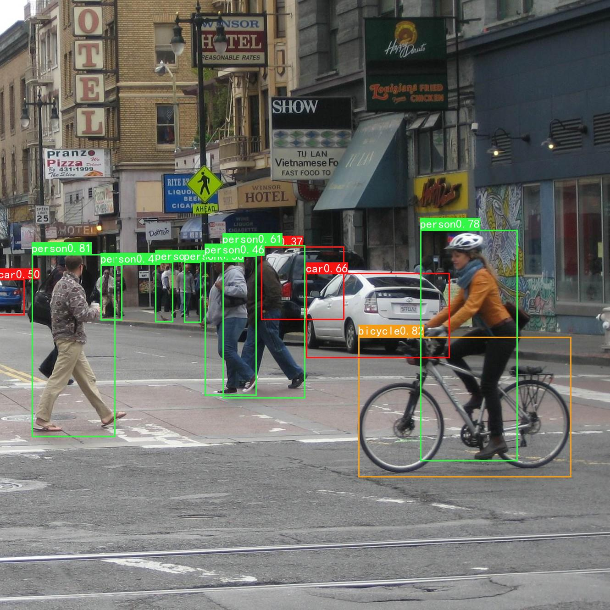

# CenterNet   Pytorch
在[bubbliiing](https://github.com/bubbliiiing/centernet-pytorch)大佬代码的基础上进行了修改，添加了部分注释。
## 图片检测demo
<br>

## 预训练模型
+ .pth格式的预训练模型来源于bubbliiing。<br>
>- 链接：https://pan.baidu.com/s/1-5j21y0NyPp4Ed1LS9BE6Q
>- 提取码：fshs

## 训练自己的数据集
### 1. 按照VOC格式准备数据集
标签文件放在VOCdevkit文件夹下的VOC2007文件夹下的Annotations中。
图片文件放在VOCdevkit文件夹下的VOC2007文件夹下的JPEGImages中。
### 2. 写入类别信息
在model_data文件夹下新建name_classes.txt文件，写入自己数据集的类别信息。

### 3. 划分数据集生成标签
修改voc_annotation.py文件下classes_path的指向，运行：
``` bash
python voc_annotation.py
```
生成的数据集划分及标签文件均存放在VOCdevkit\VOC2007\ImageSets\Main文件夹下。
### 4. 开始训练
将下载好的.pth格式预训练模型centernet_weights.pth文件放在model_data文件夹下。修改train.py下的classes_path及model_path指向，运行：
``` bash
python train.py
```
## 测试图片
修改utils/utils_centernet.py文件中的model_path及classes_path，指向训练好的模型及类别信息。
在predict_images.py文件下输入图片路径，运行：

``` bash
python predict_images.py
```
## 获取模型mAP
修改calculate_map.py文件中的classes_path,运行：
 ``` bash
 python calculate_map.py
 ```
## Reference
https://github.com/bubbliiiing/centernet-pytorch
